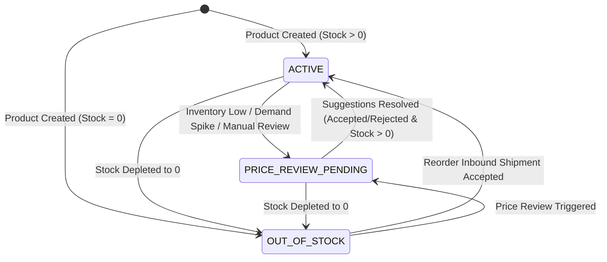
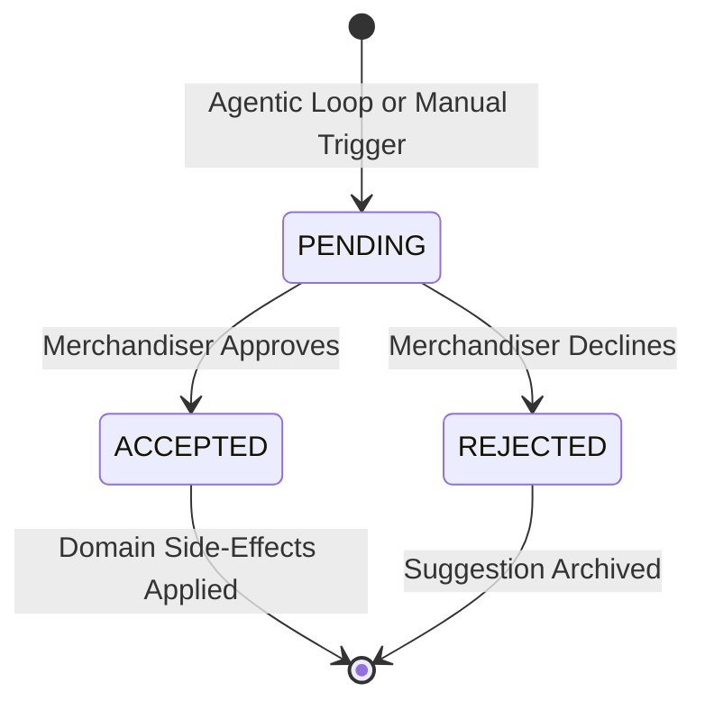

# ADR 001: Reactive Commerce Domain Model, State Transitions, and Extension Architecture

**Status:** Accepted  
**Date:** 2026-08-25  
**Context:** ShopStream Reactive Commerce Advisor (Sprint 1)  
**Authors:** Full-Stack & AI Systems Architecture Team

---

## 1. Context and Problem Statement
Traditional retail operations suffer from latency in pricing and replenishment decisions. Inventory updates in real time, but pricing reviews happen weekly via manual spreadsheets and ad-hoc Slack messages. When demand velocity spikes or stock depletes, stockouts occur at flat prices, sacrificing revenue and margin.

The objective is to establish an autonomous, event-driven reactive commerce advisor that:
1. Detects inventory depletion and demand velocity spikes automatically.
2. Formulates AI and rule-based pricing and reorder recommendations.
3. Places recommendations into an approval queue for merchandising operators.
4. Provides a solid, extensible foundation for Sprint 2 (competitor scraping, margin floors, supplier PO automation).

---

## 2. Domain Model & State Machines

### 2.1 Product Lifecycle State Machine

- **`ACTIVE`**: Standard selling state.
- **`PRICE_REVIEW_PENDING`**: System or advisor has flagged the SKU for pricing review due to stock velocity or threshold breach. Merchandising review is in progress.
- **`OUT_OF_STOCK`**: Stock has reached 0 units. Inbound reorder acceptance restores state to `ACTIVE`.

### 2.2 Suggestion Approval State Machine

- **Domain Side-Effects on `ACCEPTED`**:
  - `PricingSuggestion`: Updates `Product.currentPrice = recommendedPrice`, evaluates pending queue, and transitions Product lifecycle to `ACTIVE`.
  - `ReorderSuggestion`: Simulates inbound shipment by adding `recommendedQuantity` to `Product.stockLevel`, updates product lifecycle from `OUT_OF_STOCK` to `ACTIVE`.

---

## 3. Pluggable Strategy Architecture
The commerce engine utilizes a Strategy Pattern with runtime polymorphism:
- `IPricingStrategy` & `IReorderStrategy` define standardized contracts.
- Implementations:
  - `RuleBasedStrategy`: Deterministic heuristics using stock-to-threshold ratio and 24h order velocity with explainable reasoning.
  - `GeminiStrategy`: AI LLM advisor leveraging Google Gemini (`gemini-2.5-flash`) for multi-variable economic reasoning, perceived brand value, and dynamic stockout mitigation.
- **Zero-Downtime Strategy Switcher**: Operators can toggle the active engine between Rule-Based and Gemini AI on the fly via `/api/engine/strategy` without requiring a server reboot.

---

## 4. Agentic Loop & Deduplication Mechanism
When orders are simulated or stock is updated:
1. Signal Detector assesses if `stockLevel <= reorderThreshold` (`INVENTORY_LOW`) or `demandVelocity >= 5` (`DEMAND_SPIKE`).
2. If triggered, dispatches an asynchronous non-blocking job.
3. **Deduplication Guard**: Checks whether an existing `PENDING` recommendation is already awaiting human review with the same trigger condition. This avoids flooding the merchandising queue with redundant duplicate cards while keeping the latest high-conviction pricing current.

---

## 5. Sprint 2 & 3 Extension Points

To ensure seamless forward compatibility without breaking database migrations in subsequent sprints, the following nullable fields are baked directly into the `Product` entity:

| Extension Field | Type | Purpose in Sprint 2 & 3 |
| :--- | :--- | :--- |
| `costPrice` | `Float?` | Unit cost of goods sold (COGS). Used for margin floor calculations to prevent price drops below cost. |
| `marginFloor` | `Float?` | Minimum permissible gross profit margin percentage (e.g. 0.20 = 20%). The pricing engine clips recommendations below `costPrice * (1 + marginFloor)`. |
| `supplierId` | `String?` | References external supplier catalog for direct automated Purchase Order generation upon reorder approval. |
| `competitorPrice` | `Float?` | Baseline market scraped price from competitor feeds to guide competitive elasticity positioning. |

---

## 6. Consequences & Future Iterations
- **Positive**: Complete separation of concerns between event detection, AI reasoning, and state mutation.
- **Positive**: Human-in-the-loop safety guarantee ensures automated suggestions require merchandiser sign-off before impacting customer-facing prices.
- **Sprint 2 Roadmap**: Scheduled cron worker for rolling 24h velocity decay, real-time Webhook notifications, and automated supplier EDI dispatch.
